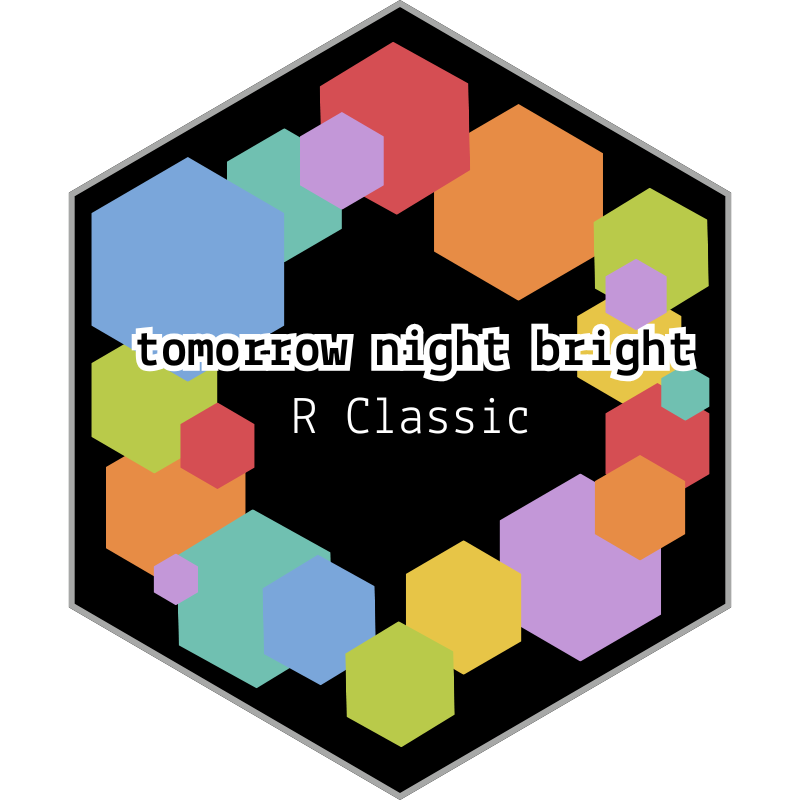

# Tomorrow Night Bright (R Classic)
> A Tomorrow Night Bright theme for Positron IDE and VS Code, inspired by RStudio IDE

<!-- badges: start -->

<!-- badges: end -->

<h2 align="center">
 
Tomorrow Night Bright (R Classic)
</h2>

<h3 align="center">
  <a href="https://github.com/gvelasq/tomorrow-night-bright-r-classic#-palette">Palette</a>
·
  <a href="https://github.com/gvelasq/tomorrow-night-bright-r-classic#-installation">Installation</a>
·
  <a href="https://github.com/gvelasq/tomorrow-night-bright-r-classic#-license">License</a>
</h3>

### 🎨 Palette

**Tomorrow Night Bright (R Classic)** is a dark, high contrast (‘bright’), MIT-licensed color theme. Tomorrow Night Bright is one of the variants included in the [Tomorrow](https://github.com/chriskempson/tomorrow-theme) theme originally written by Chris Kempson.

<table>
	<tr>
		<th></th>
		<th>Label</th>
		<th>Hex</th>
		<th>RGB</th>
	</tr>
	<tr>
		<td></td>
		<td>Red</td>
		<td><code>#d54e53</code></td>
		<td><code>rgb(213, 78, 83)</code></td>
	</tr>
	<tr>
		<td></td>
		<td>Orange</td>
		<td><code>#e78c45</code></td>
		<td><code>rgb(231, 140, 69)</code></td>
	</tr>
	<tr>
		<td></td>
		<td>Yellow</td>
		<td><code>#e7c547</code></td>
		<td><code>rgb(231, 197, 71)</code></td>
	</tr>
	<tr>
		<td></td>
		<td>Green</td>
		<td><code>#b9ca4a</code></td>
		<td><code>rgb(185, 202, 74)</code></td>
	</tr>
	<tr>
		<td></td>
		<td>Aqua</td>
		<td><code>#70c0b1</code></td>
		<td><code>rgb(112, 192, 177)</code></td>
	</tr>
	<tr>
		<td></td>
		<td>Blue</td>
		<td><code>#7aa6da</code></td>
		<td><code>rgb(122, 166, 218)</code></td>
	</tr>
	<tr>
	    <td></td>
		<td>Purple</td>
		<td><code>#c397d8</code></td>
		<td><code>rgb(195, 151, 216)</code></td>
	</tr>
</table>

This theme has two major inspirations: the editor is inspired by Posit's implementation of Tomorrow Night Bright in the RStudio IDE, and the workbench (everything outside the editor pane) is inspired by Microsoft's implementation of GitHub Dark Default.

### 🖥️ Installation

#### Install using Command Palette

1. Go to` View -> Command Palette` or press <kbd>Ctrl</kbd>+<kbd>Shift</kbd>+<kbd>P</kbd>
2. Then enter `Install Extension`
3. Write `Tomorrow Night Bright (R Classic)`
4. Select or press `Enter` to install

#### Activating theme

Open Positron. Tomorrow Night Bright (R Classic) will be available from the `File` -> `Preferences` -> `Color Theme` dropdown menu.

### 📜 License

Tomorrow Night Bright (R Classic) is released under the MIT license, which grants the following permissions:

- Commercial use
- Distribution
- Modification
- Private use

For more details, see the [LICENSE](https://github.com/gvelasq/tomorrow-night-bright-r-classic/blob/main/LICENSE) and [third party notices](https://github.com/gvelasq/tomorrow-night-bright-r-classic/blob/main/thirdpartynotices.txt).
